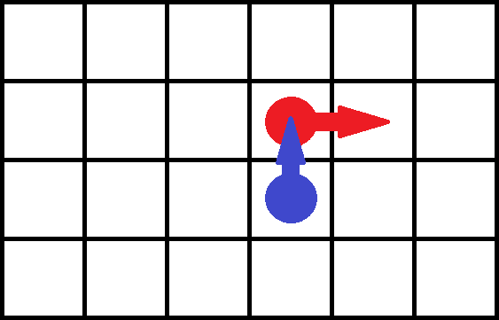
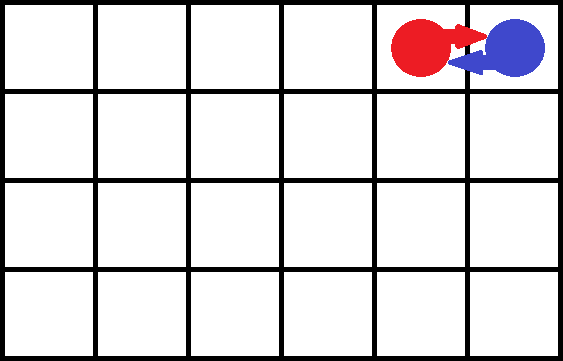
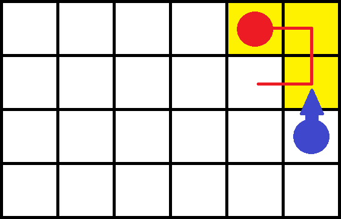

# ИДЗ4

**Выполнил:** Тимергалин Тимур Маратович, БПИ227

## Условие

**Вариант 21.** Задача о нелюдимых садовниках. Имеется пустой участок земли (двумерный массив размером M ×N) и план сада, разбитого на отдельные квадраты. От 10 до 30 процентов (задается случайно) площади сада заняты прудами или камнями. То есть недоступны для ухаживания. Эти квадраты располагаются на плане произвольным (случайным) образом. Ухаживание за садом выполняют два садовника, которые не хотят встречаться друг другом (то есть, одновременно появляться в одном и том же квадрате). Первый садовник начинает работу с верхнего левого угла сада и перемещается слева направо, сделав ряд, он спускается вниз и идет в обратном направлении, пропуская обработанные участки. Второй садовник начинает работу с нижнего правого угла сада и перемещается снизу вверх, сделав ряд, он перемещается влево и также идет в обратную сторону. Если садовник видит, что участок сада уже обработан другим садовником или является необрабатываемым, он идет дальше. Если по пути какой-то участок занят другим садовником, то садовник ожидает когда участок освободится, чтобы пройти дальше на доступный ему необработанный участок. Садовники должны работать одновременно со скоростями, определяемыми как параметры задачи. Прохождение через любой квадрат занимает некоторое время, которое задается константой, меньшей чем времена обработки и принимается за единицу времени. Создать многопоточное приложение, моделирующее работу садовников. Каждый садовник — это отдельный поток.

## Решение

Решение предполагает оценку в 9 баллов

### Словесный сценарий

Каждый из садовников, если они не находятся рядом, двигаются и работают независимо друг от друга, т.е. в отдельных потоках, обрабатывая все необработанные (и пригодные для обработки) клетки на своём пути (путь заранее известен). Однако когда пути садовников пересекаются, возникает конфликтная ситуация - и садовники вынуждены подстраиваться под поведение друг друга. Существует 2 вида конфликтных ситуаций: "перекрёсток" и "противостояние".

#### Перекрёсток

Конфликтная ситуация заключается в том, что клетка, которую хочет обработать один садовник, занята другим садовником. При этом, когда последний закончит свою работу, он будет двигаться "вбок" от первого садовника (перпендикулярно его маршруту)

*Схематичное представление:*

 

В этой ситуации задержанному садовнику (синий) достаточно просто подождать, когда другой садовник (красный) закончит работать на конфликтной клетке, ведь этому садовнику ничего не мешает (конфликт односторонний).

#### Противостояние

Конфликтная ситуация заключается в том, что садовники стоят на пути друг у друга.

*Схематичное представление:*

 

В данной ситуации просто переждать ситуацию не получится, ведь конфликт двусторонний, и требует активных действий для решения. Ниже представлены несколько возможных вариантов:

##### Метод "повышенной толерантности"

Метод заключается в том, чтобы позволить садовникам находиться на одной клетке, если они не работают. В этом случае  "противостояние" ничем не отличается от "перекрестка" - когда ожидаемый садовник закончит работу - садовники просто поменяются местами (возможно, в какой-то момент они будут на одной клетке, но недолго). Этот метод решения противостояния представлен в версии решения 1.

##### Метод "регулировщика"

Метод заключается в том, что за садовниками теперь наблюдает новое действующее лицо - регулировщик. Когда случается "противостояние", регулировщик "просыпается" и отдаёт команду садовникам поменяться местами. Таким образом, садовники не появятся в одной клетке - смена мест произойдёт одновременно благодаря руководству регулировщика. Этот метод решения противостояния представлен в версии решения 2.

##### Метод "критических участков"

Метод заключается в том, чтобы предотвращать появление противостояний заранее. Для этого вводятся так называемые "критические участки" - группы клеток, в которых может случиться противостояние. Как только один из садовников попадает в критический участок, другой садовник не может в него войти - ему нужно ждать, когда первый садовник выйдет из критического участка.

 

На картинке выше критический участок отмечен желтым цветом. Красной линией показано, какой маршрут должен сделать красный садовник перед тем, как синий сможет двинуться дальше. Нетрудно заметить, что так противостояния не случится. Разбив сад на такие участки можно полностью избежать противостояний. Данный метод решения противостояний в нашем решении не представлен, так как он сильно отличается от поведения методов 1 и 2 (однако изначально планировался он, поэтому было решено оставить его упоминание в отчёте).

### Случайность в программе

Генерация случайных чисел в программе используется для того, чтобы пометить некоторые клетки сада как недоступные для обработки. Выполняется это следующим образом:

1. Генерируется случайное действительное число $k \in [0.1;0.3]$- доля необрабатываемых клеток;
2. Создаётся битовый массив размера $mn$, заполненный нулями;
3. Первые $\lfloor kmn\rfloor$ элементов массива помечаются 1;
4. Массив перемешивается случайным образом (`std::shuffle`);
5. Клетки сада, которым в битовом массиве сопоставлена 1, помечаются, как недоступные для обработки.

### Обобщённый алгоритм

#### Общее для 2 решений

1. Генерируется сад;
2. Создаётся 2 объекта садовников (Gardener) - контейнеры для хранения координат садовников. Изначально они оба помечены координатами (-1, -1);
2. Создаётся мьютекс для доступа к координатам садовников;

#### Решение 1

4. Запускается 2 потока - каждый выполняет работу соответствующего садовника. Работа садовника представляет собой цикл for по координатам клеток (в нужном порядке). Каждая итерация цикла выглядит так:
   1. Заблокировать мьютекс;
   2. Если координаты следующей клетки совпадают с координатами другого садовника - отпустить мьютекс и подождать 1 единицу времени, вернуться в начало цикла;
   3. Иначе - сдвинуться на следующую клетку и отпустить мьютекс;
   4. Обработать клетку, если возможно;
   5. Заблокировать мьютекс;
   6. Сменить свои координаты на (-1, -1);  // Метод "повышенной толерантности" - после завершения работы в клетке, этот садовник не сможет создать конфликтной ситуации, а значит противостояния не возникнет
   7. Разблокировать мьютекс;
   8. Вернуться в начало цикла.
5. Ожидать завершение 2 потоков;
5. Освободить ресурсы.

#### Решение 2

4. Создаётся условная переменная для садовников - когда садовники будут сталкиваться с конфликтной ситуацией, они будут ждать от неё сигнала;

5. Создаётся условная переменная для регулировщика - когда случится противостояние, садовники подадут сигнал регулировщику через эту переменную;

6. Создаётся счётчик ожидающих садовников - когда он достигнет 2, садовники будут знать, что возникло противостояние, и вызовут регулировщика;

7. Запускается 3 потока - 2 для садовников, 1 - для регулировщика;

   Работа садовника представляет из себя цикл for по координатам клеток (в нужном порядке). Каждая итерация цикла выглядит так:

   1. Заблокировать мьютекс;
   2. Пока координаты следующей клетки совпадают с координатами другого садовника:
      1. Увеличить счётчик на 1;
      2. Подать сигнал регулировщику, если счётчик равен 2;
      3. Ожидать сигнала;
      4. Дождавшись (захватив при этом мьютекс обратно), уменьшить счётчик на 1;
      5. Вернуться в начало цикла.
   3. Сдвинуться на следующую клетку;
   4. Подать сигнал другому садовнику;
   5. Разблокировать мьютекс;
   6. Обработать клетку, если возможно
   7. Вернуться в начало цикла.

   Работа регулировщика представляет собой вечный цикл. Каждая итерация выглядит так:

   1. Заблокировать мьютекс;
   2. Пока в очереди меньше 2 садовников, ожидать сигнала (при этом мьютекс разблокирован);
   3. Поменять местами садовников;
   4. Подать сигнал садовникам;
   5. Разблокировать мьютекс.

8. Ожидать завершение потоков садовников;

9. Отменить поток регулировщика;

10. Освободить ресурсы;

### Модель вычислений

В первом решении реализована модель "Взаимодействующие равные" (садовники - равноправные рабочие), во втором - "Управляющий и рабочие" (регулировщик - управляющий, садовники - рабочие).

### Сравнительный анализ решений

Решения идентичны в том смысле, что конфликтные ситуации в них приводят к одинаковому поведению садовников. И в первом, и во втором решении "перекрёсток" решается ожиданием одного из садовников (но в первом решении ожидание реализовано "вручную", а во втором - с помощью условной переменной), а "противостояние" решается обменом садовников местами (но в первом решении оно происходит беспорядочно, с возможным нарушением "нелюдимости" садовников, а во втором - по сигналу регулировщика, одновременно).

### Пользовательский ввод

Ввод производится следующим образом:

1. Если аргументы командной строки имеют вид `... -input-file filename`, то из файла `filename` читаются входные данные, иначе они читаются напрямую из командной строки;
2. Если после пункта 1 не все аргументы были введены, оставшиеся запрашиваются в консоли.

Принимаются следующие аргументы:

- `n` - высота поля
- `m` - ширина поля
- `time-unit-ms` - сколько длится 1 единица времени, в миллисекундах
- `v1` - сколько времени нужно первому садовнику для обработки одной клетки, в единицах времени
- `v2` - сколько времени нужно второму садовнику для обработки одной клетки, в единицах времени
- `output-file` - путь к файлу логов
- `solution` - номер решения (1 - для первого, 2 - для второго)

Формат входного файла: пары ключ-значение, между ключем и значением - пробельные символы, между парами - пробельные символы, ключи в произвольном порядке.

Пример содержимого входного файла:

```
m 6
v2 5
output-file file.txt time-unit-ms 100
```


Формат командной строки: пары ключ-значение, название ключа помечать дефисом в начале.

Пример аргументов командной строки `-m 6 -v2 5 -output-file file.txt -time-unit-ms 100`

### Содержание решения

Решение написано на C++. Для сборки используется cmake (конфигурационный файл прилагается).

```
field/  # Содержит всё для генерации плана сада и его обхода
	Field.(h|cpp)  # Класс, представляющий сад. Содержит код распределения необрабатываемых полей
	FieldIterable.(h|cpp)  # Класс для обхода сада. Содержит итераторы для 2 садовников
gardener/Gardener.h  # Класс-контейнер для координат садовников
io/  # Содержит все для ввода и вывод
	input.(h|cpp)  # Функции для пользовательского ввода (из файла, командной строки и консоли)
    Output.(h|cpp)  # Класс для вывода в несколько файловых потоков со встроенной синхронизацией
task_v1/  # Первое решение
	Task.(h|cpp)  # Класс, содержащий код для отдельного потока-садовника
	solution.(h|cpp)  # Решение 1 - основная функция
task_v2/  # Второе решение
	TrafficGuard/  # Содержит все для решения конфликтов
		GardenerQueue.(h|cpp)  # Класс, автоматизирующий всю синхронизацию в программе (и для садовников, и для регулировщика)
		TrafficGuard.(h|cpp)  # Класс, содержащий код для потока-регулировщика
    Task.(h|cpp)  # Класс, содержащий код для отдельного потока-садовника
    solution.(h|cpp)  # Решение 2 - основная функция
main.py # Основная программа
```

## Примеры работы программы

Примеры работы приведены в папке `examples`